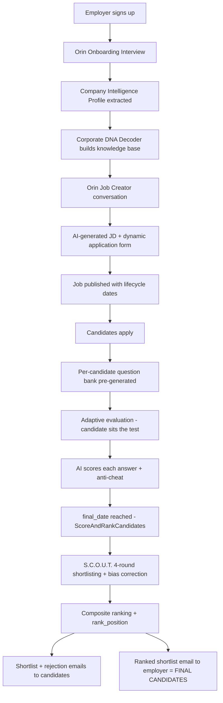

# Employer AI Pipeline — End-to-End (Account → Final Candidate)

> **Scope:** This document maps **every AI touchpoint** in the employer journey on StudAI Hire, from the moment an employer creates an account to the moment they receive the final ranked shortlist of candidates. It includes the **actual system/user prompts**, the **models**, **temperatures**, **token limits**, **data flow**, **database artifacts**, and the **queue/cron orchestration** that ties it together.
>
> The employer-facing AI persona is **Orin™**. The employer-side autonomous screening engine is branded **S.C.O.U.T.**
>
> **Source of truth:** All prompts and parameters below are quoted verbatim from the codebase (`app/Services/AI/**`, `app/Jobs/**`, `app/Http/Controllers/Employer/**`, `app/Console/Commands/**`).

---

## 0. AI Engine & Infrastructure

| Item | Value | Source |
|------|-------|--------|
| Primary provider | **Azure OpenAI** | [config/ai.php](../config/ai.php#L16) |
| Primary model (Orin™) | **GPT-5.4** (deployment `gpt-5.4`) | [config/ai.php](../config/ai.php#L27) |
| Embeddings model | `text-embedding-3-large` | [config/ai.php](../config/ai.php#L34) |
| Fallback provider | **Azure Anthropic — Claude Sonnet 4.6** | [config/ai.php](../config/ai.php#L44) |
| API version | `2025-04-01-preview` | [config/ai.php](../config/ai.php#L28) |
| Core gateway | `AIService::callAzureOpenAI()` | [app/Services/AI/AIService.php](../app/Services/AI/AIService.php#L46) |
| Resilience | Circuit breaker (OpenAI + Anthropic), response caching, AI-credit gating | [app/Services/AI/AIService.php](../app/Services/AI/AIService.php#L160) |

Every employer AI service extends `AIService` and calls `callAzureOpenAI($messages, $options)`, which POSTs to:

```
{endpoint}/openai/deployments/{deployment_id}/chat/completions?api-version={api_version}
```

Request body shape (from `callAzureOpenAI`):

```json
{
  "messages": [ ... ],
  "max_completion_tokens": <max_tokens>,
  "temperature": <temperature>
}
```

---

## Pipeline Overview



---

## Stage 1 — Account Creation & Conversational Onboarding (Orin™)

**What the AI does:** Instead of a static form, Orin™ runs a **multi-turn conversational interview** with the new employer, then **extracts a structured Company Intelligence Profile** from the dialogue.

**Wiring:**
- UI: `employer.onboarding-chat` view
- Controller: [OrinOnboardingController](../app/Http/Controllers/Employer/OrinOnboardingController.php) (`show`, `chat`, `skip`)
- Service: [OrinOnboardingService](../app/Services/AI/OrinOnboardingService.php)
- Output table: `company_intelligence_profiles` (model `CompanyIntelligenceProfile`)

### 1a. Conversation driver — `nextMessage()`

- **Model:** GPT-5.4 · **temperature `0.7`** · **max_completion_tokens `400`**

**System prompt (verbatim):**

```
You are Orin™, the AI talent intelligence engine for StudAI Hire, powered by Azure OpenAI GPT-5.4.
You are conducting a friendly, conversational onboarding interview with an employer who has just joined the platform.
Your goal is to build a comprehensive Company Intelligence Profile through natural dialogue — NOT a form.

You need to learn about:
1. Company basics: name, industry, size, headcount, founded year, website, CIN/GST
2. Team structure and current headcount by function
3. Work culture: collaborative, autonomous, fast-paced, structured, startup vs corporate feel
4. Compensation philosophy: competitive, below-market, equity-heavy, performance-linked
5. Salary bands by level: junior, mid, senior, lead
6. Work mode: remote, hybrid, on-site, location preferences
7. Hiring frequency: one-time, seasonal, ongoing, bulk hiring
8. Top 3 traits of their best-performing employees (probe for specifics)
9. Biggest current hiring pain points (probe for specifics)
10. Any compliance or regulatory requirements (POSH, FCRA, background checks)
11. Preferred communication style with candidates

Rules:
- Ask only 1-2 topics per message. Never dump all questions at once.
- If the employer gives a vague answer, probe with a follow-up.
- Be warm, professional, and encouraging.
- When you have collected enough (at least 7 of the 11 topics), conclude by saying: "Thank you! I have everything I need to build your Intelligence Profile. Type DONE to complete setup."
- Never ask for information already provided in this conversation.
```

A second system message injects account context: `Company account details: Name={company->name}, Email domain registered.` The full chat history (roles `user`/`assistant`) is then replayed each turn. When the employer types **DONE**, the controller calls `extractProfile()`.

### 1b. Profile extraction — `extractProfile()`

- **Model:** GPT-5.4 · **temperature `0.1`** · **max_completion_tokens `1000`**

The whole transcript is flattened to `ROLE: content` lines and sent with this **extraction system prompt (verbatim):**

```
Extract company intelligence profile from the conversation below. Return ONLY valid JSON with these keys: industry, company_size (micro/small/medium/large/enterprise), headcount (integer), founded_year, cin_gst, website, work_culture, work_mode_preference (remote/hybrid/onsite), top_performer_traits (array of strings), salary_bands (object: junior/mid/senior/lead each with min and max in INR per year), compensation_philosophy, pain_points (array), preferred_candidate_communication, hiring_frequency (one-time/seasonal/ongoing/bulk), compliance_requirements (array). Use null for anything not mentioned.
```

**Post-processing:** strips ``` fences → `json_decode` → computes a **completeness score** (filled fields out of 11 → `0–100%`) → `CompanyIntelligenceProfile::updateOrCreate()` with `onboarding_complete = true`.

**Skip path:** `skip()` writes a minimal profile with `completeness_score = 10`.

---

## Stage 2 — Company Knowledge Base (Corporate DNA Decoder)

**What the AI does:** Builds a deeper **organizational "DNA" profile** used later to weight candidate cultural fit and success-trait alignment. This is the employer's persistent AI knowledge base.

**Wiring:**
- Job: [AnalyzeCompanyDNAJob](../app/Jobs/AnalyzeCompanyDNAJob.php) → Service: [CorporateDNADecoderService](../app/Services/AI/Scout/CorporateDNADecoderService.php)
- Controller entry: [ScoutController](../app/Http/Controllers/ScoutController.php)
- Output models: `CompanyDNAProfile`, `CultureAnalysis`, `SuccessIndicator`
- Cached 24h (`company_dna_analysis_{companyId}`)

It first **gathers organizational data** (mission/vision, core values, employee count, accepted-hire count, top performers, avg tenure, retention rate, promotion data, skill & work-style patterns of top performers), then makes **three AI calls**:

### 2a. `performDNAAnalysis()` — work style / communication / decision style

- **Model:** GPT-5.4 · **temperature `0.3`** · **max_tokens `2000`**
- **System:** `You are an expert organizational psychologist and HR analytics specialist. Analyze company data to decode organizational DNA, cultural patterns, and success factors. Return only valid JSON.`

**User prompt (verbatim, variables interpolated):**

```
Analyze this organization's DNA and provide structured insights in JSON format.

**Organization Profile:**
- Company: {company_name}
- Industry: {industry}
- Size: {company_size} ({employee_count} employees analyzed)
- Mission: {mission_statement}
- Vision: {vision_statement}
- Core Values: {core_values}

**Performance Metrics:**
- Top Performers: {top_performer_count}
- Average Tenure: {avg_tenure} months
- Retention Rate: {retention_rate}%

**Skill Patterns in Top Performers:**
{skill_patterns}

**Work Style Observations:**
{work_style_data}

Return JSON with:
{
  "work_style_preferences": ["autonomous", "collaborative", "structured", etc.],
  "communication_patterns": ["async-first", "meeting-heavy", "documentation-focused", etc.],
  "decision_making_style": "consensus-driven" | "data-driven" | "hierarchical" | "agile",
  "summary": "2-3 sentence organizational DNA summary"
}
```

### 2b. `extractCulturalDNA()` — 5–8 scored cultural traits

**User prompt (verbatim):**

```
Based on this organizational data, identify 5-8 core cultural DNA traits that define this company's identity.

**Data:**
- Mission: {mission_statement}
- Values: {core_values}
- Top Performer Count: {top_performer_count}
- Retention Rate: {retention_rate}%
- Work Styles: {work_style_data}

Return JSON array of cultural DNA traits with scores 0-100:
[
  {"trait": "Innovation-Driven", "score": 85, "evidence": "High experimentation in top performers"},
  {"trait": "People-First", "score": 92, "evidence": "95% retention, strong collaboration"},
  ...
]
```

### 2c. `identifySuccessTraits()` — traits of top performers
Produces the `success_traits` array stored on `CompanyDNAProfile`, plus a **DNA completeness score** and **analysis confidence**. These feed Stage 6 (S.C.O.U.T. Round 2 skill-trait alignment & Round 3 culture fit).

---

## Stage 3 — Job Creation (Orin™ Job Creator)

**What the AI does:** A second conversational flow where Orin™ interviews the employer about a specific role, **extracts structured job data**, **writes the full JD**, and **generates a tailored application form**.

**Wiring:**
- Controller: [OrinJobCreatorController](../app/Http/Controllers/Employer/OrinJobCreatorController.php)
- Service: [OrinJobCreatorService](../app/Services/AI/OrinJobCreatorService.php)
- Output: `jobs` row (with `orin_generated_jd`, `orin_application_form_fields`, lifecycle dates, `application_link_token`)

**Shared system prompt (verbatim):**

```
You are Orin™, the AI talent intelligence engine for StudAI Hire, built on Azure OpenAI GPT-5.4.
You are acting as an expert talent acquisition consultant helping an employer create a job posting.
Your role is to ask smart, targeted questions in a conversational manner — never like a form.
Probe for specifics. If the employer is vague, ask follow-up questions.
Keep responses concise, professional, and friendly.
```

### 3a. Conversational questioning — `nextQuestion()`

- **temperature `0.7`** · **max_completion_tokens `500`**
- System prompt is appended with a **company context** line (`buildCompanyContext`): `Company: {name}. Industry: {industry}. Culture values: {culture}.`
- Plus targeting instructions (verbatim):

```
The employer wants to create a job for: {roleName}. Brief description: {roleDescription}
```
```
You need to collect: salary range, work mode, experience level, must-have vs nice-to-have skills, application open/close dates, evaluation start date, finalisation date, target hire count, portfolio/GitHub requirements, and any mandatory screening questions. Ask naturally one or two topics at a time.
```

### 3b. Structured extraction — `extractJobData()`

- **temperature `0.1`** · **max_completion_tokens `1000`** · **System:** `You are a JSON extractor. Return only valid JSON, no markdown.`

**User prompt (verbatim):**

```
From the conversation below, extract the following fields into a JSON object.
Use null for any field not mentioned. Return ONLY valid JSON.

Fields to extract:
- salary_min (integer, in INR per year)
- salary_max (integer, in INR per year)
- salary_currency (string, default "INR")
- location_type (enum: "remote"|"hybrid"|"onsite")
- experience_level (enum: "entry"|"junior"|"mid"|"senior"|"lead"|"executive")
- required_skills (array of strings)
- preferred_skills (array of strings)
- open_date (date YYYY-MM-DD or null)
- close_date (date YYYY-MM-DD or null)
- eval_start_date (date YYYY-MM-DD or null)
- final_date (date YYYY-MM-DD or null)
- target_hire_count (integer, default 1)
- requires_portfolio (boolean)
- requires_github (boolean)
- requires_work_sample (boolean)
- mandatory_screening_questions (array of strings)
- employment_type (enum: "full_time"|"part_time"|"contract"|"internship")

CONVERSATION:
{transcript}
```

### 3c. JD generation — `generateJobDescription()`

- **temperature `0.7`** · **max_completion_tokens `2000`**

**User prompt (verbatim):**

```
You are Orin™, writing a job description for a {roleName} role.

Company context:
{companyContext}

Role brief from employer: {roleDescription}

Collected details:
- Experience level: {expLevel}
- Work mode: {workMode}
- Required skills: {skills}
- Preferred skills: {preferredSkills}

Write a compelling, ATS-optimised job description with these sections:
1. About the Role (2-3 sentences, engaging)
2. What You'll Do (5-7 bullet points, specific responsibilities)
3. What We're Looking For (must-haves then nice-to-haves)
4. What We Offer (benefits, culture, growth opportunities)
5. About [Company Name] (1 paragraph from the company context)

Use active voice. Be specific, not generic. Avoid corporate buzzword padding.
Format in clean Markdown.
```

### 3d. Dynamic application form — `generateApplicationFormFields()`

- **temperature `0.3`** · **max_completion_tokens `1000`** · **System:** `Return only valid JSON, no markdown.`

**User prompt (verbatim):**

```
You are Orin™. Generate a dynamic application form for a {roleName} role.
Required skills: {skills}
Work mode: {locationTypeValue}

Return a JSON array of form fields. Each field has:
- name (snake_case string)
- label (human readable)
- type (text|textarea|select|checkbox|url|file)
- required (boolean)
- options (array of strings for select type, or null)
- placeholder (string or null)

Include: standard fields (name, email, phone, LinkedIn) + 3-5 role-specific fields.
Return ONLY valid JSON array, no markdown.
```

### 3e. Persist — `createJob()`
Combines 3c + 3d, persists the `Job` with `status = published`, `application_phase = open`, a shareable `application_link_token`, and the four lifecycle dates (`open_date`, `close_date`, `eval_start_date`, `final_date`). If AI fails, falls back to a default 5-field form and a minimal JD.

---

## Stage 4 — Candidates Apply → Per-Candidate Question Bank

When applications arrive, the platform **pre-generates a unique adaptive question bank per candidate** so no two candidates get identical tests.

**Wiring:**
- Job: [GenerateCandidateQuestions](../app/Jobs/GenerateCandidateQuestions.php) → Service: [OrinEvaluationService::generateQuestionBank()](../app/Services/AI/OrinEvaluationService.php)
- Output table: `question_banks`

For **each difficulty tier** (`foundational`, `intermediate`, `advanced`), Orin™ generates **5 questions**:

- **temperature `0.8`** · **max_completion_tokens `3000`**

**System prompt (verbatim):**

```
You are Orin™, the AI evaluation engine for StudAI Hire.
You are evaluating candidates for job roles. Your questions must be:
- Specific to the candidate's background and the role requirements
- Professionally worded and unambiguous
- Progressive in difficulty
- Fair and bias-free
Return only valid JSON as instructed.
```
(+ `Return only valid JSON, no markdown.`)

**User prompt (verbatim):**

```
Generate {count} unique {difficulty}-level evaluation questions for a candidate.

Job Context: {jobContext}
Candidate Context: {candidateContext}

Return a JSON array of {count} questions. Each question object:
{
  "difficulty": "{difficulty}",
  "question_type": "mcq"|"short_answer"|"scenario"|"code_snippet"|"case_study",
  "topic": "topic name",
  "question_text": "the question",
  "options": ["A. option1", "B. option2", "C. option3", "D. option4"] or null,
  "correct_answer": "for mcq only, e.g. A" or null,
  "evaluation_rubric": "scoring criteria for open questions" or null,
  "time_limit_seconds": 60-300,
  "max_score": 10,
  "is_behavioural": false,
  "is_culture_fit": false
}

Questions must be:
- Unique to THIS candidate based on their background
- Specific to the role's required skills
- Varied in type (mix MCQ with open-ended)
Return ONLY valid JSON array.
```

- **Candidate context** = skills, current title, years of experience (or guest name).
- **Job context** = `Role: {title}. Required skills: {skills}. Level: {experience_level}.`

---

## Stage 5 — Adaptive Evaluation & AI Answer Scoring

**What the AI does:** Runs an **adaptive, anti-cheat assessment session** and **AI-scores open-ended answers**.

**Wiring:** [OrinEvaluationService](../app/Services/AI/OrinEvaluationService.php) (`startSession`, `getCurrentQuestion`, `submitAnswer`, `recordAntiCheatEvent`, `finaliseSession`). Active state lives in **Redis** (`eval_session:{token}`, TTL 2h); skeleton persists to `evaluation_sessions`.

### Adaptive difficulty engine
- **Escalate** after **3 consecutive correct** (`foundational → intermediate → advanced`).
- **De-escalate** after **2 consecutive wrong** (`advanced → intermediate → foundational`).

### Scoring (`scoreAnswer`)
- **MCQ:** auto-scored (string compare vs `correct_answer`).
- **Open-ended:** AI-scored — **temperature `0.1`** · **max_completion_tokens `200`** · **System:** `Score the answer. Return only valid JSON.`

**User prompt (verbatim):**

```
Question: {question_text}

Candidate's Answer: {answerText}

Evaluation Rubric: {rubric}

Score this answer from 0 to {max_score}. Return JSON:
{"score": number, "is_correct": boolean, "feedback": "brief 1-sentence feedback for candidate"}
```

### Anti-cheat
- Tracks `tab_switch_count` / `focus_loss_count`; **≥5 tab switches** flags the session (`flagged_for_review = true`).

### Finalisation (`finaliseSession`)
- Raw score = total/maxPossible × 100.
- **Difficulty-weighted score:** foundational ×1.0, intermediate ×1.5, advanced ×2.0.
- Writes `evaluation_score` to the `Application`; clears Redis.

---

## Stage 6 — Ranking, S.C.O.U.T. Shortlisting & Final Candidates

This is the **"final candidate"** stage. It is **cron-driven** by job lifecycle dates.

### 6a. Cron orchestration — `orin:process-deadlines` (hourly)

[ProcessJobApplicationDeadlines](../app/Console/Commands/ProcessJobApplicationDeadlines.php) advances each job through its lifecycle:

| Trigger | Phase change | Action |
|---------|--------------|--------|
| `close_date` ≤ today (phase `open`) | → closing | dispatch `ProcessBulkApplicationClose` |
| `eval_start_date` ≤ today (phase `closed`) | → `evaluating` | enable evaluation |
| `final_date` ≤ today (phase `evaluating`) | → ranking | dispatch **`ScoreAndRankCandidates`** |

### 6b. Composite ranking — `ScoreAndRankCandidates`

[ScoreAndRankCandidates](../app/Jobs/ScoreAndRankCandidates.php) computes a **bias-corrected weighted composite** for every completed evaluation:

```
composite =  evaluation_score        × 0.45   (assessment performance)
           + skill_match_score        × 0.25   (skills vs JD)
           + resume_quality_score     × 0.15   (resume quality)
           + behavioural_fit_score    × 0.15   (culture fit)
           − anti_cheat_penalty
```

Anti-cheat penalty = `min(20, tab_switch_count × 2)` + `10` if flagged.

Then it sorts desc, writes `final_rank_score` + `rank_position` to each `Application`, sets job phase `ranked`, and dispatches **`SendShortlistNotifications`** + per-candidate **`SendSkillFeedbackEmail`**.

### 6c. S.C.O.U.T. 4-round deep screening (optional/parallel pipeline)

[AutomatedShortlistingService::executeShortlistingPipeline()](../app/Services/AI/Scout/AutomatedShortlistingService.php) runs a **gated 4-round funnel** (a candidate must pass each round to advance). Uses the **Company DNA** knowledge base from Stage 2.

| Round | Name | Weight | Logic | Pass |
|-------|------|--------|-------|------|
| 1 | Basic Qualification | 15% | education, min experience, work authorization, location, certifications | ≥60 |
| 2 | Skills & Competency | 35% | required (60%) + preferred (20%) + DNA success-trait alignment (20%), then soft skills | ≥50 |
| 3 | Cultural Fit | 30% | value alignment (40%) + work-style (30%) + communication style (20%) + team dynamics (10%) — uses `CompanyDNAProfile` | ≥60 |
| 4 | Potential & Growth | 20% | learning agility (40%) + career trajectory (35%) + future potential (25%) | ≥45 |

`overall_score = R1×0.15 + R2×0.35 + R3×0.30 + R4×0.20`. Shortlisted candidates are sorted by `overall_score`, with explicit `strengths`/`concerns` evidence.

### 6d. Responsible-AI explainability (logged on every decision)
Both `CandidateScreeningService::analyzeCandidate()` and the S.C.O.U.T. pipeline log an **explainable-AI audit record** via `ExplainableAIService::record()` into `ai_decision_logs` — capturing `score`, `recommendation` (`shortlist`/`review`/`reject`), `confidence`, contributing `factors`, and a **natural-language explanation** per candidate. This provides the "reasoning shown" promised in the product copy and supports bias auditing.

### 6e. Candidate screening helper (recruiter-facing, on demand)

[CandidateScreeningService](../app/Services/AI/CandidateScreeningService.php) produces an at-a-glance analysis for a single application (cached 1h): skill match, experience match, **AI culture-fit**, strengths, concerns, recommendation, and suggested interview questions.

**Culture-fit AI prompt (verbatim):**

```
Analyze culture fit between candidate and company:

Candidate Profile:
- Bio: {bio}
- Career Goals: {career_goals}
- Work Preferences: {work_preferences json}

Company Culture:
- Description: {company description}
- Values: {company values json}
- Work Environment: {work_environment}

Provide a culture fit analysis with:
1. Alignment score (0-100)
2. Key alignment points
3. Potential mismatches
4. Overall assessment

Format as JSON: {"score": 0-100, "alignment_points": [], "mismatches": [], "assessment": ""}
```
(model = `config('ai.azure.models.chat')`, **temperature `0.3`**)

Recommendation banding: ≥85 *Strong Match* (interview now), ≥70 *Good Match* (shortlist), ≥50 *Potential*, else *Weak Match (reject)*.

---

## Stage 7 — Final Candidate Delivery (Emails)

[SendShortlistNotifications](../app/Jobs/SendShortlistNotifications.php) closes the loop. Top `target_hire_count` ranks (by `rank_position`) are the **final candidates**.

- **Shortlisted candidates** → congratulations email ("ranked in the top N").
- **Other candidates** → courteous rejection + pointer to their Orin™ feedback report.
- **Employer** → "Evaluation complete — Top N candidates" email containing a **ranked table** (`#rank`, candidate, `final_rank_score%`) and a dashboard link. Job phase → `complete`.

In parallel, [SendSkillFeedbackEmail](../app/Jobs/SendSkillFeedbackEmail.php) uses `OrinEvaluationService::generateSkillFeedback()` to AI-write each candidate's personalised report.

**Skill-feedback prompt (verbatim):**

```
Generate a personalised performance feedback report for a candidate who just completed the Orin™ AI evaluation.

Candidate context: {candidateCtx}
Job context: {jobCtx}
Evaluation score: {evalScore}/100
Skill match score: {skillScore}/100
Final composite score: {finalScore}/100
Questions attempted: {questionsAnswered}

Provide:
1. A brief (2-3 sentence) overall performance summary — encouraging yet honest.
2. Top 3 strengths demonstrated in this evaluation.
3. Top 3 specific improvement areas with actionable next steps (courses, practice suggestions).
4. One motivational closing note.

Format your response as plain HTML (no markdown code fences). Use <h3>, <p>, <ul>, <li> tags only. Keep it concise — under 400 words total.
```
(**max_completion_tokens `600`**)

---

## Appendix A — AI Call Parameter Matrix

| Stage | Service · Method | Temp | Max tokens | Returns |
|-------|------------------|------|-----------|---------|
| 1a | `OrinOnboardingService::nextMessage` | 0.7 | 400 | chat text |
| 1b | `OrinOnboardingService::extractProfile` | 0.1 | 1000 | JSON profile |
| 2a | `CorporateDNADecoderService::performDNAAnalysis` | 0.3 | 2000 | JSON |
| 2b | `CorporateDNADecoderService::extractCulturalDNA` | (default) | (default) | JSON array |
| 3a | `OrinJobCreatorService::nextQuestion` | 0.7 | 500 | chat text |
| 3b | `OrinJobCreatorService::extractJobData` | 0.1 | 1000 | JSON |
| 3c | `OrinJobCreatorService::generateJobDescription` | 0.7 | 2000 | Markdown JD |
| 3d | `OrinJobCreatorService::generateApplicationFormFields` | 0.3 | 1000 | JSON array |
| 4 | `OrinEvaluationService::generateQuestionsForDifficulty` | 0.8 | 3000 | JSON array |
| 5 | `OrinEvaluationService::scoreAnswer` | 0.1 | 200 | JSON score |
| 6e | `CandidateScreeningService::analyzeCultureFit` | 0.3 | (default) | JSON |
| 7 | `OrinEvaluationService::generateSkillFeedback` | (default) | 600 | HTML |

## Appendix B — Key Data Artifacts

| Table / Model | Produced in | Holds |
|---------------|-------------|-------|
| `CompanyIntelligenceProfile` | Stage 1 | industry, salary bands, culture, pain points, completeness |
| `CompanyDNAProfile` / `CultureAnalysis` / `SuccessIndicator` | Stage 2 | cultural DNA traits, success traits, work/comms style |
| `Job` (`orin_generated_jd`, `orin_application_form_fields`) | Stage 3 | JD, dynamic form, lifecycle dates, link token |
| `QuestionBank` | Stage 4 | per-candidate adaptive questions |
| `EvaluationSession` (+ Redis) | Stage 5 | live session, scores, anti-cheat flags |
| `Application` (`evaluation_score`, `final_rank_score`, `rank_position`) | Stage 5–6 | scoring + ranking |
| `AIDecisionLog` (`ai_decision_logs`) | Stage 6 | explainable-AI audit per decision |
| `BulkEmailLog` | Stage 7 | shortlist/rejection email batch status |

## Appendix C — Resilience & Guardrails
- **Every AI method is wrapped in try/catch** with deterministic fallbacks (default form, default JD, default question bank, "scoring pending review").
- **Circuit breaker** on both Azure OpenAI and Azure Anthropic; automatic **fallback to Claude Sonnet 4.6**.
- **Response caching** + **AI-credit gating** in `AIService::callAI`.
- **Bias correction** (anti-cheat penalty) and **explainable-AI logging** for fairness/compliance.
- **Secrets** are environment-only; no keys are stored in config or code.
