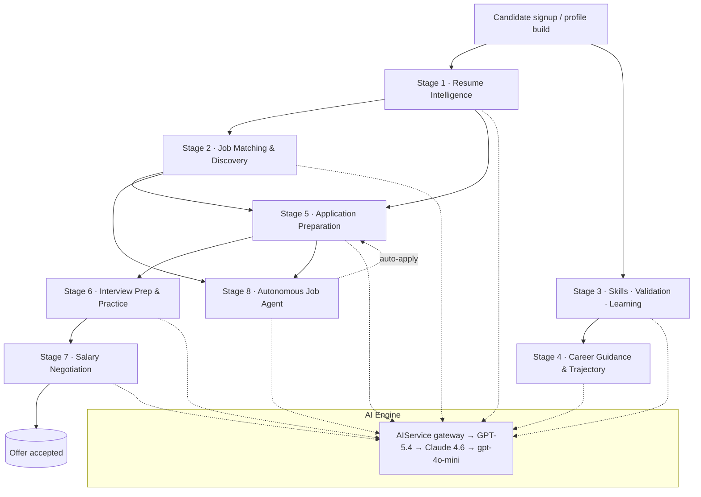
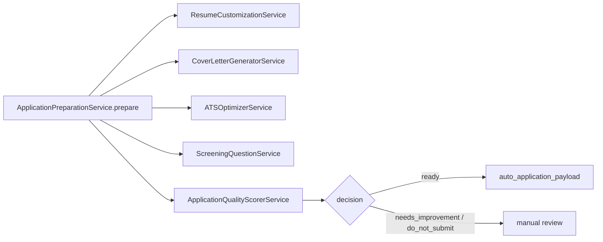
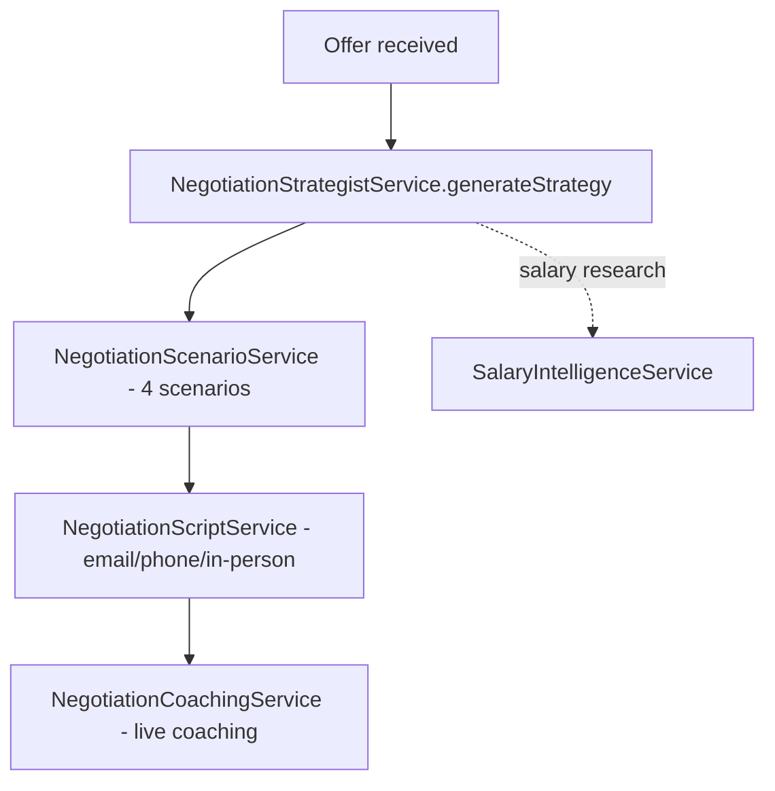
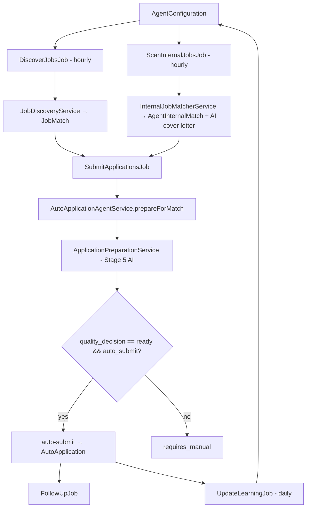
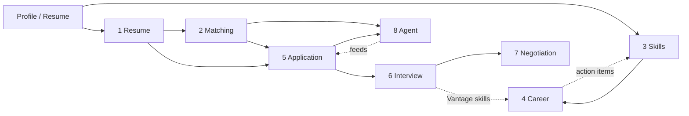

# Student / Candidate AI Pipeline — End-to-End Audit

> Companion document to [EMPLOYER_AI_PIPELINE.md](EMPLOYER_AI_PIPELINE.md).
> This document maps **every candidate-side AI touchpoint** in StudAI Hire / StudAI Career:
> the engine, every AI service, the **verbatim** prompts, models / temperatures / token limits,
> the features they power, the database artifacts they write, and how the whole thing is wired together
> (controllers, Livewire, jobs, routes, schedulers).

**Audit date:** 2026-05-31 · **Framework:** Laravel 12.x / PHP 8.3 · **Admin/UI:** Filament 4.x
**Primary model:** Azure OpenAI **GPT‑5.4** (the “Orin™” engine) · **Fallback:** Azure Anthropic **Claude Sonnet 4.6** → legacy OpenAI `gpt‑4o‑mini`
**Embeddings:** `text-embedding-3-large` · **API version:** `2025-04-01-preview`

---

## 0. AI Engine & Infrastructure

Every candidate feature ultimately calls the **single AI gateway** `AIService`. There are no direct OpenAI
facade calls from controllers or views — all traffic is centralized, cached, credit‑gated, and circuit‑broken.

| Concern | Where | Detail |
|---|---|---|
| Config | [config/ai.php](../config/ai.php) | Provider selection, models, timeouts, cache TTLs, circuit breaker, rate limits, prompt registry |
| Gateway | [app/Services/AI/AIService.php](../app/Services/AI/AIService.php) | `callAzureOpenAI()`, `callAzureAnthropic()`, `callAI()`, `callAIForJSON()`, `callWithMessages()`, `compactConversation()`, `generateText()`, `generateEmbedding()`, `cosineSimilarity()` |
| Convenience trait | `App\Services\AI\Concerns\InteractsWithAI` | `ai()`, `aiJSON()` wrappers used by most services |
| Usage logging trait | `App\Traits\LogsAiUsage` | `logAiUsage()` → `ai_usage_logs` |
| Resilience | `App\Services\CircuitBreakerService` | Opens after 5 failures / 60s window, closes after 2 successes, 30s recovery |
| Ops alerting | `App\Services\OpsAlertService` | `ai.fallback.anthropic` and degradation alerts |
| Credit gating | `User::hasAICredits()` + `AICreditLog` | Per‑tier monthly credits enforced before any call |

### 0.1 Request shape (Azure OpenAI)

`callAzureOpenAI(array $messages, array $options)` POSTs to:

```
{endpoint}/openai/deployments/{deployment_id}/chat/completions?api-version={api_version}
```

Body: `{ messages, max_completion_tokens, temperature, response_format? }`
(`response_format = {"type":"json_object"}` when `json_mode`/`response_format` option is set).

### 0.2 Fallback chain (`callAI()`)

1. **Tier 1 — Azure OpenAI GPT‑5.4** (circuit‑breaker wrapped)
2. **Tier 2 — Azure Anthropic Claude Sonnet 4.6** (OpenAI→Anthropic message conversion; JSON reinforced via system instruction since Claude has no native `response_format`)
3. **Tier 3 — legacy OpenAI `gpt‑4o‑mini`** (only if `OPENAI_API_KEY` set; disabled by default)
4. **Final — `fallbackResponse()`** safe default

### 0.3 Key config keys

| Key | Default | Purpose |
|---|---|---|
| `ai.provider` / `ai.fallback_provider` | `azure` / `anthropic` | Provider selection |
| `ai.azure.deployment_id` | `gpt-5.4` | Primary chat deployment |
| `ai.azure.models.chat_mini` | `gpt-5.4` | “mini” variant used for cheap scoring tasks |
| `ai.azure.models.embeddings` | `text-embedding-3-large` | Semantic matching |
| `ai.parameters.max_tokens` / `temperature` | `16384` / `0.7` | Defaults when a service doesn’t override |
| `ai.cache.*` | redis, context TTLs | `resume_analysis 1h`, `job_matching 2h`, `cover_letter 30m`, `interview_prep 1h`, `career_advice 24h`, `skills_extraction 24h`, `embeddings 7d` |
| `ai.circuit_breaker.*` | 5 fail / 2 success / 30s | Cascade protection |
| `ai.rate_limits.*` | free 10 / pro 200 / premium 1000 / enterprise ∞ | Monthly credits + hourly caps |
| `ai.ranking.weights` | eval .45 / skill .25 / resume .15 / behaviour .15 | Shared candidate ranking weights |
| `ai.prompts.*` | registry | Centralized prompt templates (resume, cover letter, job match, interview, salary, skill gap, career, agent) |

---

## Pipeline Overview



---

## Stage 1 · Resume Intelligence

**What the AI does:** parses uploaded resumes, scores ATS compatibility, extracts/categorizes skills,
rewrites bullets into quantified achievements, and tailors the resume to a specific job.

**Wiring**

| Concern | Reference |
|---|---|
| Web routes | `resume.ai.generate-summary`, `resume.ai.extract-skills`, `resume.ai.optimize-for-job`, `resume.ai.analyze-ats` in [routes/web.php](../routes/web.php) / [routes/resume.php](../routes/resume.php) |
| Controller | [app/Http/Controllers/ResumeController.php](../app/Http/Controllers/ResumeController.php) |
| Livewire | [app/Livewire/ProfileWizard.php](../app/Livewire/ProfileWizard.php) (resume upload flow) |
| Output models | `Resume`, `ResumeAISuggestion`, `AIResumeGeneration` |

### 1.1 `ResumeAnalyzerService` — [app/Services/AI/ResumeAnalyzerService.php](../app/Services/AI/ResumeAnalyzerService.php)

Extends `AIService`. Read‑only analysis (no DB writes). Methods: `analyzeResume`, `getResumeFeedback`,
`optimizeForJob`, `calculateATSScore`, `extractSkills`, `generateSummary`.

**`analyzeResume()`** — model GPT‑5.4, default temp/tokens, via `callAIForJSON()`:

System:
```
You are an expert resume analyzer. Extract structured information from resumes and provide detailed analysis.
Always respond with valid JSON format.
```
User (abridged schema):
```
Analyze this resume and extract the following information in JSON format:
{ "personal_info": {...}, "summary": "...", "experience": [...], "education": [...],
  "skills": {...}, "certifications": [...], "projects": [...] }

Resume text:
$resumeText
```

**`getResumeFeedback()`** — `callAIForJSON($prompt, $system, ['cache_hours' => 1])`:

System:
```
You are an expert career coach and resume reviewer. Provide constructive, actionable feedback to improve resumes.
Always respond with valid JSON format.
```
User returns: `overall_score, strengths[], weaknesses[], suggestions[], missing_elements[], keywords_to_add[], formatting_issues[], ats_compatibility_score, estimated_experience_level`.

**`optimizeForJob()`** system:
```
You are an ATS (Applicant Tracking System) optimization expert. Help candidates tailor their resumes for specific jobs.
Always respond with valid JSON format.
```

**`calculateATSScore()`** system:
```
You are an ATS system analyzer. Evaluate resume compatibility with automated tracking systems.
```

**`extractSkills()`** system:
```
You are a skills extraction and categorization expert.
```

**`generateSummary()`** system (plain‑text via `callAI()`):
```
You are a professional resume writer specializing in compelling summary statements.
```

### 1.2 `ResumeAIService` — [app/Services/AI/ResumeAIService.php](../app/Services/AI/ResumeAIService.php)

Uses `InteractsWithAI`. Per‑user (`forUser()`), AI‑credit tracked, logs to `AIResumeGeneration`.

| Method | System prompt | Temp |
|---|---|---|
| `generateProfessionalSummary()` | `You are an expert resume writer and career coach. Create professional, compelling summaries that highlight achievements and value proposition.` | 0.7 |
| `optimizeExperienceBullets()` | `You are an expert resume writer. Rewrite bullet points to be achievement-focused. Return strictly JSON.` | 0.7 |
| `extractSkills()` | `You are an AI that extracts and categorizes skills from professional backgrounds. Always respond with valid JSON only.` | 0.3 |
| `quantifyAchievement()` | `You are an expert at transforming job responsibilities into measurable achievements with specific metrics.` | 0.8 |

`quantifyAchievement()` user prompt (verbatim):
```
Transform this work responsibility into a quantified achievement using the STAR method (Situation, Task, Action, Result). Add specific metrics, percentages, or numbers:

Responsibility: {$description}
Context: {$context}

Provide only the achievement bullet point.
```

### 1.3 `ResumeCustomizationService` — [app/Services/AI/ResumeCustomizationService.php](../app/Services/AI/ResumeCustomizationService.php)

`customize(User, DiscoveredJob, $baseResume, $options)` → GPT‑5.4, **temp 0.35, max_tokens 3500, skip_cache**, via `AIService::callWithMessages()`.

System:
```
You are a world-class technical resume optimizer who tailors resumes for ATS systems and human recruiters.
```
Returns a full structured resume JSON: `headline, summary, core_competencies[], experience_sections[]
(company,title,location,dates,bullets[],keywords_used[],metrics[],priority), skills_section, education_section[],
certifications[], resume_changes[], optimized_keywords[], ats_score, warnings[], formatting_tips[]`.
Consumed by `ApplicationPreparationService`.

### 1.4 `ATSOptimizerService` — [app/Services/AI/ATSOptimizerService.php](../app/Services/AI/ATSOptimizerService.php)

`analyze(string $resume, DiscoveredJob $job)` → GPT‑5.4, **temp 0.25, max_tokens 2200, skip_cache**.

System:
```
You are an Applicant Tracking System expert who evaluates resumes for alignment with job postings. Provide actionable, concise recommendations.
```
Returns `score, section_scores{summary,experience,skills,education}, missing_keywords[], suggested_changes[], formatting_issues[], optimized_resume, warnings[], summary`.

---

## Stage 2 · Job Matching & Discovery

**What the AI does:** scores candidate↔job fit (embeddings + LLM), discovers external jobs, and matches
internal platform jobs.

| Service | File | AI? |
|---|---|---|
| `JobMatchingService` | [app/Services/AI/JobMatchingService.php](../app/Services/AI/JobMatchingService.php) | Embeddings (`text-embedding-3-large`) + `cosineSimilarity()` + LLM match score (`ai.prompts.job_match_score`) |
| `JobDiscoveryService` | [app/Services/Agent/JobDiscoveryService.php](../app/Services/Agent/JobDiscoveryService.php) | Deterministic 5‑dimension scoring (role 35 / skills 30 / salary 15 / location 12 / company flags 8) |
| `InternalJobMatcherService` | [app/Services/Agent/InternalJobMatcherService.php](../app/Services/Agent/InternalJobMatcherService.php) | Deterministic scoring + AI cover letter for matches ≥ 70% |

`ai.prompts.job_match_score` (config registry):
```
system: You are an expert job-candidate matching specialist...
user:   Score this match (0-100)... Return JSON with: score, matched_skills, missing_skills, recommendation...
```

Outputs: `JobMatch` (`overall_match_score`, `score_breakdown`, `matching_skills[]`, `missing_skills[]`,
`agent_decision`, `decision_reasoning`, `confidence_score`), `DiscoveredJob`, `AgentInternalMatch`.
Surfaced through `jobs.search` ([app/Http/Controllers/JobController.php](../app/Http/Controllers/JobController.php))
and the hourly agent jobs (Stage 8). `SendJobAlerts` console command reuses `calculateMatchScore()`.

---

## Stage 3 · Skills · Validation · Learning

**What the AI does:** validates claimed skills against evidence, finds gaps vs target roles, generates and grades
skill assessments, forecasts skill trends, and curates personalized learning paths.

**Wiring**

| Concern | Reference |
|---|---|
| Web | `/skills/dashboard`, `/skills/learning-paths`, `/skills/validation` → [app/Http/Controllers/SkillAnalyzerWebController.php](../app/Http/Controllers/SkillAnalyzerWebController.php) |
| API | `POST /api/skills/analyze`, `GET /api/skills/gaps`, `POST /api/skills/validate`, `POST /api/skills/assessment/{skillId}`, `GET /api/skills/trends`, `POST /api/skills/learning-path/{gapId}` → [app/Http/Controllers/API/SkillAnalyzerController.php](../app/Http/Controllers/API/SkillAnalyzerController.php) |
| Jobs | `AnalyzeSkillGapsJob`, `ValidateUserSkillsJob`, `AnalyzeTrendsJob`, `CurateLearningResourcesJob`, `SendDailyLearningRecommendationJob` |
| Output models | `SkillGap`, `SkillValidation`, `UserSkill`, `SkillAssessment`, `SkillTrend`, `LearningPath`, `LearningResource`, `LearningProgress` |

### 3.1 `SkillValidatorService` — [app/Services/AI/SkillValidatorService.php](../app/Services/AI/SkillValidatorService.php)

`validateUserSkills()` (cached 30d). System (temp **0.2**):
```
You are an expert resume analyst and skill assessor. Extract and validate professional skills from work history with high accuracy.
```
Per‑skill output: `confidence_score, proficiency_level, years_of_experience, evidence_source, key_evidence[], validation_strength`. Auto‑verifies `user_skills` when confidence ≥ 80.

`validateSkillClaim()` (model `chat_mini`, temp 0.3) system:
```
You are a skill validation expert. Be critical but fair.
```

### 3.2 `SkillGapAnalyzer` & `SkillGapAnalyzerService`

- [SkillGapAnalyzer.php](../app/Services/AI/SkillGapAnalyzer.php) — `prioritizeSkills()` (temp **0.6**): `You are a career development expert specializing in skill gap analysis and learning path optimization.`; `identifyTrendingSkills()` (temp 0.5): `You are a market analyst tracking skill demand trends.`
- [SkillGapAnalyzerService.php](../app/Services/AI/SkillGapAnalyzerService.php) — `analyzeUserSkillGaps()` (cached 1h) calls `getRequiredSkillsForRoles()` (temp **0.3**): `You are an expert career advisor and labor market analyst. Provide detailed, data-driven insights about skill requirements for specific roles.` Persists ranked `SkillGap` rows; powers `AnalyzeSkillGapsJob`.

### 3.3 `SkillAssessmentGeneratorService` — [app/Services/AI/SkillAssessmentGeneratorService.php](../app/Services/AI/SkillAssessmentGeneratorService.php)

`generateQuestions()` (temp **0.7**, cached 24h):
```
You are an expert assessment designer and technical interviewer. Create challenging, fair, and accurate skill assessment questions.
```
`gradeCodeAnswer()` (temp **0.3**):
```
You are a code reviewer and technical interviewer. Grade fairly and provide constructive feedback.
```
Writes `SkillAssessment` (questions, answers, results, feedback); can boost `UserSkill.proficiency_level`.

### 3.4 Skill trend services

- `SkillTrendAnalysisService` ([file](../app/Services/AI/SkillTrendAnalysisService.php)) — **pure data/maths** (no LLM); writes `SkillTrend` (demand, growth, salary premium, momentum).
- `SkillTrendPredictorService` ([file](../app/Services/AI/SkillTrendPredictorService.php)) — `predictSkillTrends()` (temp **0.5**, cached 30d): `You are a technology futurist and labor market analyst specializing in skill trend forecasting.`; `analyzeSkillOutlook()` (temp 0.4, cached 1w): `You are a career strategist and technology trend analyst.`

### 3.5 `LearningPathCuratorService` — [app/Services/AI/LearningPathCuratorService.php](../app/Services/AI/LearningPathCuratorService.php)

`generateLearningPath(SkillGap, User)` (cached 24h) discovers resources across YouTube/Udemy/Coursera/GitHub
then `scoreResourceRelevance()` (model `chat_mini`, temp **0.3**):
```
You are an expert educational content curator. Score learning resources by relevance and quality.
```
Writes `LearningPath` + `LearningResource`; drives `CurateLearningResourcesJob` and the daily recommendation job.

---

## Stage 4 · Career Guidance & Trajectory

**What the AI does:** high‑level career paths & salary insight, multi‑turn conversational coaching, and a 10‑year
trajectory model.

| Service | File | Output models |
|---|---|---|
| `CareerAdvisorService` | [file](../app/Services/AI/CareerAdvisorService.php) | transient advice (no writes) |
| `CareerCoachService` | [file](../app/Services/AI/CareerCoachService.php) | `CareerCoachSession`, `CareerCoachMessage`, `CareerCoachSuggestion`, `CareerGoal` |
| `CareerTrajectoryService` | [file](../app/Services/AI/CareerTrajectoryService.php) | `UserCareerTrajectory`, `PredictedCareerPath`, `CareerMilestone`, `MarketDisruption` |

### 4.1 `CareerAdvisorService` (extends `AIService`, `callAIForJSON()`, default temp 0.7)

| Method | System prompt |
|---|---|
| `getCareerPaths()` | `You are an expert career advisor with deep knowledge of career trajectories, industry trends, and professional development.` |
| `getSalaryInsights()` | `You are a compensation analysis expert with comprehensive knowledge of salary trends, geographic variations, and industry standards.` |
| `analyzeCareerTransition()` | `You are a career transition specialist helping professionals navigate career changes.` |
| `getIndustryTrends()` | `You are an industry analyst with expertise in market trends, emerging technologies, and workforce dynamics.` |
| `createDevelopmentPlan()` | `You are a professional development coach creating personalized growth plans.` |

### 4.2 `CareerCoachService`

Routes `career-coach.*` → [app/Http/Controllers/CareerCoachController.php](../app/Http/Controllers/CareerCoachController.php);
real‑time via Livewire [app/Livewire/CareerCoachChat.php](../app/Livewire/CareerCoachChat.php).
`generateResponse()` calls `callAzureOpenAI()` directly, **temp 0.7, max_completion_tokens 450**, 9 session types.

System prompt (verbatim, dynamic):
```
You are an expert AI Career Coach for the StudAI Hire platform. Your role is to provide personalized, actionable career guidance.

USER PROFILE:
- Name: {$this->user->name}
- Current Role: {$profile?->headline}
- Years of Experience: {$this->calculateYearsOfExperience()}
- Skills: {$this->formatSkills()}
- Career Goals: {$profile?->career_goals}

ACTIVE GOALS:
{$goals}

COACHING STYLE:
{$coachingStyle}

RESPONSE FORMAT — FOLLOW STRICTLY EVERY SINGLE REPLY:
1. Be concise: maximum 2–3 sentences OR 3 bullet points. Never write a wall of text.
2. Every sentence must add value — no filler, no repetition of what the user said.
3. End EVERY response with exactly ONE focused question to guide the conversation forward.
4. After your question, ALWAYS include an "**Options:**" block with 3–4 short reply suggestions the user can tap. Each option must be under 8 words.
5. Use this exact structure every time:

[Concise insight — 2–3 sentences max]

[Your one question?]

**Options:**
- [short option 1]
- [short option 2]
- [short option 3]

6. Use Indian Rupees (₹) for any salary/compensation figures.
7. Be warm, direct, and encouraging — like a smart friend who happens to be a career expert.

{$typeInstructions}
```
`extractActionItems()` (temp 0.3, `callAIForJSON()`) mines the transcript for `{task, priority}` items.

### 4.3 `CareerTrajectoryService`

`getAIPredictions()` → `callWithMessages()`, **temp 0.7, max_tokens 4000**, cached 24h:
```
You are an expert career counselor with access to millions of career progression data points. Analyze career trajectories and provide accurate predictions based on real market data, skill requirements, and success probabilities.
```
Generates 5 ranked `PredictedCareerPath` records (target role, timeline, success probability, skill gaps,
milestones, salary projections, risks). `detectMarketDisruptions()` (temp **0.5, max_tokens 2000**):
`You are a market analyst tracking industry disruptions.`

---

## Stage 5 · Application Preparation

**What the AI does:** assembles a submit‑ready application package — tailored resume + cover letter + ATS check +
screening answers + a quality/readiness gate. Orchestrated by `ApplicationPreparationService`.



### 5.1 `ApplicationPreparationService` — [file](../app/Services/AI/ApplicationPreparationService.php)
Pure orchestrator (no direct AI call). Returns `{resume, cover_letter, ats, screening_answers, quality, auto_application_payload}`.
Invoked by one‑click apply (`api.jobs.apply`) and by the autonomous agent.

### 5.2 `CoverLetterGeneratorService` — [file](../app/Services/AI/CoverLetterGeneratorService.php)
`generate()` → GPT‑5.4, **temp 0.55**, cached 4h. Also exposed at `POST /api/ai/generate-cover-letter`.
```
You are an executive career coach who writes persuasive cover letters that balance professionalism with authenticity.
```
Returns `subject_line, greeting, intro_paragraph, body_paragraphs[], closing_paragraph, signature, postscript,
keywords_highlighted[], confidence_score, talking_points[], tone_notes`.

### 5.3 `ApplicationQualityScorerService` — [file](../app/Services/AI/ApplicationQualityScorerService.php)
`evaluate()` → GPT‑5.4, **temp 0.3, max_tokens 2000, skip_cache**:
```
You are an autonomous job application coach who evaluates submission readiness with evidence-backed reasoning.
```
Returns `readiness_score, confidence, component_scores{resume,cover_letter,ats_alignment,screening},
decision (ready|needs_improvement|do_not_submit), risk_flags[], recommended_actions[], summary, next_steps[]`.
This is the gate the agent checks before auto‑submitting.

### 5.4 `ApplicationOptimizerService` — [file](../app/Services/AI/ApplicationOptimizerService.php)
`analyzeApplication()` system: `You are an expert at optimizing job applications for maximum success rate.`
`analyzeApplicationHistory()` system: `You are an expert at analyzing job search performance and providing data-driven recommendations.`

### 5.5 `CompanyResearchService` — [file](../app/Services/AI/CompanyResearchService.php)
Aggregates Glassdoor/LinkedIn/website + AI. `generateTalkingPoints()` (temp 0.7, cached 7d):
`You are a career research expert helping candidates prepare for interviews.`
`generateAIInsights()` (model `chat_mini`, temp 0.7): `You are an expert interview coach with deep knowledge of company cultures and hiring practices.`

---

## Stage 6 · Interview Preparation & Practice

10 interconnected services. All AI grading is logged to `AIInterviewCalculation`. Persona engine = **Vantage**.

**Wiring:** `interview.*` routes → [app/Http/Controllers/InterviewController.php](../app/Http/Controllers/InterviewController.php);
video at `/video-interview/*` → [app/Http/Controllers/VideoInterviewController.php](../app/Http/Controllers/VideoInterviewController.php).
Output models: `InterviewSession`, `InterviewResponse`, `InterviewQuestion`, `VideoInterviewSession`, `CoachingSkillScore`.

### 6.1 `InterviewPrepService` — [file](../app/Services/AI/InterviewPrepService.php) (extends `AIService`, temp 0.7)

| Method | System prompt | Cache |
|---|---|---|
| `generateQuestions()` | `You are an expert interviewer and hiring manager who creates realistic, relevant interview questions.` | default |
| `evaluateAnswer()` | `You are an expert interview coach providing constructive feedback on interview answers.` | disabled |
| `generateMockInterview()` | `You are an expert at creating realistic, personalized mock interviews.` | default |
| `getAnsweringTips()` | `You are an expert interview coach specializing in helping candidates structure compelling answers.` | default |
| `generateCandidateQuestions()` | `You are an expert career coach helping candidates prepare thoughtful questions to ask interviewers.` | default |
| `prepareForFormat()` | `You are an expert at preparing candidates for different interview formats.` | default |
| `analyzeCompany()` | `You are an expert at researching companies and preparing candidates for interviews.` | default |
| `generateFollowUp()` | `You are an expert at crafting professional, memorable interview follow-up emails.` | disabled |
| `prepareSalaryDiscussion()` | `You are an expert salary negotiation coach.` | default |

### 6.2 `InterviewQuestionGenerator` — [file](../app/Services/AI/InterviewQuestionGenerator.php)

Company/role‑specific generation via `callWithMessages()` (skip_cache), logs `AIInterviewCalculation`:

| Method | System prompt | Temp / tokens |
|---|---|---|
| `generateForCompanyRole()` | `You are an expert interview preparation coach who generates realistic, company-specific interview questions based on deep industry knowledge and company research.` | 0.7 / 3000 |
| `generateBehavioral()` | `You are an expert at creating STAR methodology behavioral interview questions.` | 0.7 / 2000 |
| `generateTechnical()` | `You are an expert technical interviewer with deep knowledge across various technology stacks.` | 0.8 / 3000 |
| `generateFollowUp()` | `You are an experienced interviewer who asks insightful follow-up questions.` | 0.7 / 300 |

### 6.3 `AnswerEvaluationService` — [file](../app/Services/AI/AnswerEvaluationService.php)

`evaluateAnswer(InterviewResponse)` runs five sub‑evaluations and writes scores back to `InterviewResponse`:

| Sub‑eval | System prompt | Temp / tokens |
|---|---|---|
| `evaluateContent()` | `You are an expert interview evaluator focused on content quality.` | 0.3 / 500 |
| `analyzeSTAR()` | `You are an expert at analyzing STAR methodology in interview answers.` | 0.2 / 600 |
| `evaluateClarity()` | `You are an expert in evaluating communication clarity.` | 0.3 / 400 |
| `evaluateConfidence()` | `You are an expert at detecting confidence levels in communication.` (hybrid: rules + AI) | 0.3 / 300 |
| `detectFillerWords()` | regex only — no AI | — |

### 6.4 `MockInterviewService` — [file](../app/Services/MockInterviewService.php)

Drives `interview.start`. `generateQuestions()` (cached 2h, timeout 25s, max_tokens 2000):
```
You are a senior recruiter. Return ONLY valid JSON. No markdown. No extra text.
```
`evaluateAnswer()`:
```
You are an experienced interview coach. Evaluate answers constructively. Keep overall_feedback to 2 sentences maximum — one sentence on what was good, one on the key improvement needed. Be direct and specific.
```
`formatWithSTAR()`: `You are an interview coach helping candidates structure their answers clearly using the STAR method.`
`getCommonQuestions()` (cached 1d): `You are an interview expert with deep knowledge of hiring practices.`
`getInterviewTips()`: `You are a career coach specializing in interview preparation.`

### 6.5 Vantage engine (future‑ready skills)

- **`VantageEvaluatorService`** ([file](../app/Services/VantageEvaluatorService.php)) — grades a transcript against
  OECD Learning Compass 2030 / WEF Future‑of‑Jobs across 5 skills (critical_thinking, collaboration,
  communication, creativity, adaptability), **temp 0.3, max_tokens 2000**. System:
  ```
  You are an expert pedagogical evaluator trained on OECD Learning Compass 2030 and WEF Future of Jobs competency frameworks. Return ONLY valid JSON.
  ```
  Writes `InterviewSession.skill_map`, `vantage_score`, `evaluator_ran_at` and `CoachingSkillScore` rows.
- **`VantageCoachingService`** ([file](../app/Services/VantageCoachingService.php)) — runs 5 workplace scenarios
  (Team Conflict, Data‑Driven Decision, Stakeholder Alignment, Pivoting Under Pressure, Innovation Sprint).
  Base persona prompt:
  ```
  You are a world-class executive coach running a Skills Practice session for {$userName}.
  ... You play the OTHER characters in this scenario (colleagues, managers, clients) — not a coach observer.
  ... After the user responds, briefly step out of character to offer ONE crisp coaching observation (in [COACH] tags), then continue the scenario.
  Start the scenario immediately ... Do NOT introduce yourself as an AI.
  ```
- **`VantageExecutiveService`** ([file](../app/Services/VantageExecutiveService.php)) — **no AI call**; builds
  adaptive, turn‑by‑turn steering prompts in three phases (Turns 1–3 Rapport, 4–7 Targeted Probes, 8–10 Synthesis)
  injected into the coaching persona.

### 6.6 Transcription & video

- **`SpeechToTextService`** ([file](../app/Services/AI/SpeechToTextService.php)) — OpenAI **Whisper‑1**, temp 0.0,
  `verbose_json` with word/segment timestamps; chunks files > 25 MB via ffmpeg; optional Google STT fallback.
- **`VideoInterviewService`** ([file](../app/Services/VideoInterviewService.php)) — session/recording orchestration;
  dispatches `AnalyzeVideoInterview` + `TranscribeVideoRecording` jobs (AI is indirect via those jobs).
- **`InterviewGenerationService`** ([file](../app/Services/Interview/InterviewGenerationService.php)) — legacy
  `OpenAIService` path; per‑question generation (behavioral 0.7 / technical 0.6 / situational 0.7, 500 tokens).

---

## Stage 7 · Salary Negotiation

**What the AI does:** builds a market‑grounded negotiation strategy, generates risk‑scored scenarios and
communication scripts, and coaches the candidate in real time.



### 7.1 `NegotiationStrategistService` — [file](../app/Services/AI/NegotiationStrategistService.php)
Market research via `aiJSON()`:
```
You are a compensation intelligence analyst with deep knowledge of the Indian job market (2024-2025).
```
Company intelligence via `ai()` (temp 0.7, cached 24h):
```
You are a company culture and negotiation analyst. Provide brief, actionable insights about company negotiation flexibility and culture.
```
Writes `NegotiationStrategy` (`market_median`, `market_percentile_25/75/90`, `optimal_ask`,
`minimum_acceptable`, `stretch_goal`, `strongest_points[]`, `value_propositions[]`, `risk_factors[]`,
`recommended_tactics[]`, `company_culture_analysis`, `ai_summary`). Route `POST /api/negotiation/strategy`
([app/Http/Controllers/API/NegotiationController.php](../app/Http/Controllers/API/NegotiationController.php)).
Has a non‑AI `calibratedFallback()`.

### 7.2 `NegotiationScenarioService` — [file](../app/Services/AI/NegotiationScenarioService.php)
Generates 4 scenarios (Conservative / Balanced / Aggressive / Alternative Benefits) deterministically, then
`analyzeScenarioWithAI()` (temp 0.7): `You are an expert negotiation analyst. Provide tactical, data-driven scenario analysis.` Writes `NegotiationScenario`.

### 7.3 `NegotiationScriptService` — [file](../app/Services/AI/NegotiationScriptService.php)
`generateScripts()` → `callWithMessages()`, **temp 0.7, max_tokens 800, skip_cache**:
```
You are an expert negotiation coach. Generate professional, persuasive negotiation scripts that are tactful, data-driven, and relationship-preserving.
```
Writes `NegotiationScript` (subject/opening/body/closing + talking points, phrases to use/avoid, anchoring tactics). Lazily generated per scenario.

### 7.4 `NegotiationCoachingService` — [file](../app/Services/AI/NegotiationCoachingService.php)
`analyzeEmployerMessage()` → `callWithMessages()`, **temp 0.7, max_tokens 500, skip_cache** (real‑time):
```
You are an expert negotiation coach providing real-time tactical guidance. Be specific, actionable, and strategic.
```
Writes `NegotiationSession` / `NegotiationMessage`. Template‑based response generators provide tap‑able suggestions.

### 7.5 `SalaryIntelligenceService` — [file](../app/Services/AI/SalaryIntelligenceService.php)
**No LLM** — deterministic percentile/trend maths over `Job` data; writes `SalaryTrend` (cached 1h). Feeds the strategist’s market research.

> The Vantage evaluator also grades negotiation sessions (`evaluateNegotiationSession()`), writing skill scores back to `NegotiationSession`.

---

## Stage 8 · Autonomous Job Agent

**What the AI does:** a multi‑service orchestrator that discovers jobs hourly, scores them, AI‑customizes the full
application, submits within user limits, follows up, and learns from outcomes.



| Component | File | AI? |
|---|---|---|
| `AutoApplicationAgentService` | [file](../app/Services/Agent/AutoApplicationAgentService.php) | delegates to `ApplicationPreparationService` (Stage 5) |
| `JobDiscoveryService` | [file](../app/Services/Agent/JobDiscoveryService.php) | deterministic scoring |
| `InternalJobMatcherService` | [file](../app/Services/Agent/InternalJobMatcherService.php) | AI cover letter ≥ 70% match |
| Jobs | [app/Jobs/Agent/](../app/Jobs/Agent/) | `DiscoverJobsJob`, `ScanInternalJobsJob`, `SubmitApplicationsJob`, `FollowUpJob`, `UpdateLearningJob` |
| API | [app/Http/Controllers/API/AgentController.php](../app/Http/Controllers/API/AgentController.php) | `config/configure/activate/deactivate/discover/matches/applications/statistics/analytics` |

**Guardrails:** `daily_application_limit`, `applications_this_month`, `require_approval` + `approval_threshold`,
`active_hours[]` / `active_days[]`, global kill switch (`AgentConfiguration::isGlobalKillSwitchActive()`),
and emergency‑stop fields. Feature‑gated by the `autonomous_agent` subscription. Audit trail in `AgentAuditLog`;
learning metrics in `AgentLearningMetric`.

---

## How It’s All Connected



- **Profile/resume** is the root input. Stage 1 structures it; Stage 3 validates skills and finds gaps.
- **Stage 2** matching feeds both manual apply (Stage 5) and the **autonomous agent** (Stage 8), which loops back
  into Stage 5 to build packages and into the quality gate before auto‑submitting.
- **Career coach** action items (Stage 4) route users into Stage 3 (learning) and Stage 6 (interview prep).
- **Vantage** skill scores from Stage 6 feed back into career development (Stage 4).
- A single **decision‑explanation** surface ([app/Http/Controllers/Candidate/DecisionExplanationController.php](../app/Http/Controllers/Candidate/DecisionExplanationController.php),
  route `candidate.decision-explanation`) reads `AIDecisionLog` to give candidates a GDPR Art. 22 / India DPDP‑compliant
  explanation of any automated decision.

---

## Database Artifacts (candidate‑side)

| Domain | Models / tables |
|---|---|
| Resume | `Resume`, `ResumeAISuggestion`, `AIResumeGeneration` |
| Matching | `JobMatch`, `DiscoveredJob`, `SavedJob` |
| Skills & learning | `SkillGap`, `SkillValidation`, `UserSkill`, `SkillAssessment`, `SkillBadge`, `SkillTrend`, `LearningPath`, `LearningResource`, `LearningProgress` |
| Career | `CareerCoachSession`, `CareerCoachMessage`, `CareerCoachSuggestion`, `CareerCoachCheckin`, `CareerCoachPreference`, `CareerGoal`, `UserCareerTrajectory`, `PredictedCareerPath`, `CareerMilestone`, `MarketDisruption` |
| Application | `Application`, `CoverLetter`, `AutoApplication` |
| Interview | `InterviewSession`, `InterviewResponse`, `InterviewQuestion`, `InterviewCoachingTip`, `VideoInterviewSession`, `VideoInterviewQuestion`, `VideoInterviewRecording`, `CoachingSkillScore`, `AIInterviewCalculation` |
| Negotiation | `NegotiationStrategy`, `NegotiationScenario`, `NegotiationScript`, `NegotiationSession`, `NegotiationMessage`, `SalaryTrend` |
| Agent | `AgentConfiguration`, `AgentInternalMatch`, `AgentAuditLog`, `AgentLearningMetric` |
| AI ops | `AIConversation`, `AICreditLog`, `AIDecisionLog`, `ai_usage_logs` |

---

## Routes, Jobs & Schedules (candidate‑side)

### Key routes

| Feature | Route name | Service |
|---|---|---|
| Resume AI | `resume.ai.generate-summary` / `extract-skills` / `optimize-for-job` / `analyze-ats` | `ResumeAIService` / `ResumeAnalyzerService` |
| Cover letter | `cover-letter.generate`, `api.ai.generate-cover-letter` | `CoverLetterGeneratorService` |
| Skills | `skills.analyzer`, `POST /api/skills/analyze|validate|assessment|trends|learning-path` | Skill cluster |
| Career profile | `profile.career.auto-fill`, `profile.career.suggestions` | `ResumeAIService`, `CareerAdvisorService` |
| Interview | `interview.start`, `interview.submit-answer`, `interview.follow-up`, `interview.format-star`, `interview.complete` | `MockInterviewService`, `InterviewPrepService`, `VantageEvaluatorService` |
| Career coach | `career-coach.session.message`, `career-coach.checkin` | `CareerCoachService` |
| Job match/apply | `jobs.search`, `api.jobs.apply` | `JobMatchingService`, `ApplicationPreparationService` |
| Negotiation | `POST /api/negotiation/strategy|sessions/{id}/analyze` | Negotiation cluster |
| Agent | `agent.dashboard|configure|applications`, `/api/agent/*` | Agent cluster |
| Decision explanation | `candidate.decision-explanation` | `AIDecisionLog` (read‑only) |

### Jobs & schedules

| Job | Cadence | Timeout / tries | Calls |
|---|---|---|---|
| `AnalyzeSkillGapsJob` | weekly / on profile update | 300s · 3 tries · backoff [60,120,240] | `SkillGapAnalyzerService` |
| `ValidateUserSkillsJob` | on experience update | — | `SkillValidatorService` |
| `AnalyzeTrendsJob` | scheduled | — | `SkillTrendAnalysisService` |
| `CurateLearningResourcesJob` | on demand | — | `LearningPathCuratorService` |
| `SendDailyLearningRecommendationJob` | daily | 120s · 3 tries | learning recommendations |
| `Agent\DiscoverJobsJob` | hourly | 600s · 3 tries | `JobDiscoveryService` → dispatches `SubmitApplicationsJob` |
| `Agent\ScanInternalJobsJob` | hourly | — | `InternalJobMatcherService` |
| `Agent\SubmitApplicationsJob` | on demand | 900s · 2 tries | `AutoApplicationAgentService` → `ApplicationPreparationService` |
| `Agent\FollowUpJob` | on demand | — | follow‑up messaging |
| `Agent\UpdateLearningJob` | daily | — | `AgentLearningService` |
| `AnalyzeVideoInterview` / `TranscribeVideoRecording` | on upload | — | `SpeechToTextService` + analysis |
| `SendJobAlerts` (command) | daily | — | `JobMatchingService` |

---

## Temperature Cheat‑Sheet

| Range | Used for | Examples |
|---|---|---|
| 0.0–0.2 | deterministic / strict grading | Whisper (0.0), STAR analysis (0.2), skill validation (0.2) |
| 0.25–0.35 | factual extraction / scoring | ATS analyze (0.25), content/clarity/confidence eval (0.3), resume customization (0.35), skill requirements (0.3) |
| 0.4–0.6 | balanced analysis / forecasting | skill outlook (0.4), trend prediction (0.5), disruptions (0.5), cover letter (0.55), skill prioritization (0.6) |
| 0.7 | conversational / generative | career coach (0.7), interview questions (0.7), trajectory (0.7), negotiation (0.7) |
| 0.8 | creative variation | technical question variety (0.8), achievement rewriting (0.8) |

---

*End of audit. Generated from static analysis of `app/Services/AI/`, `app/Services/Agent/`,
`app/Services/`, `app/Http/Controllers/`, `app/Jobs/`, `routes/`, and `config/ai.php`.*
